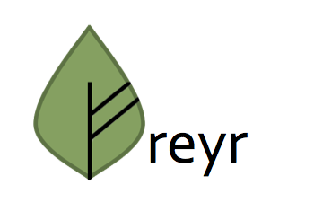
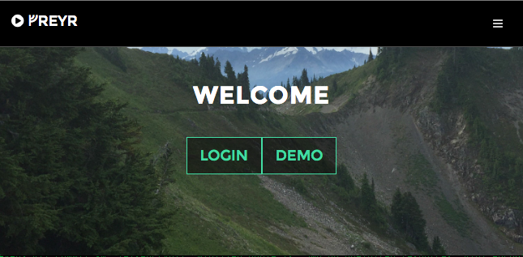
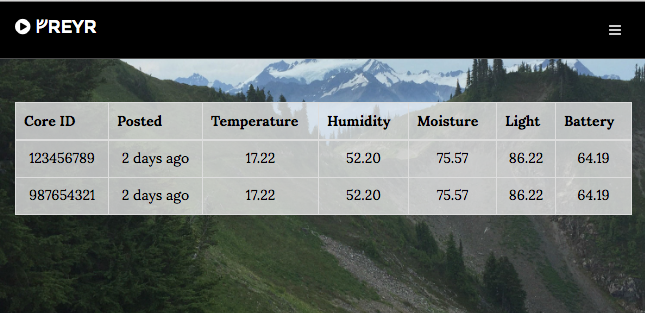
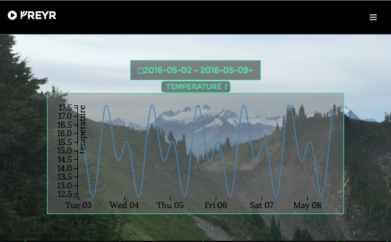

# What?

A pet project to design a simple garden sensor and custom server for aggregating data and providing a simple user interface.

- Nginx gateway for scaling, static file hosting, and SSL termination
- Golang API backend 
- ReactJS single page web app
- Postgres database
- Docker driven integration tests and deployment
- More buzzwords as I can add them in, sorry no Haskell in the foreseeable future

# Why?

The intent is to merge my interests in sustainability, backend system software development, embedded programming, and electronics tinkering while providing the opportunity to practice with programming techniques I may not get to use as much as I like during my day-job.

# Where?

Running @ [https://freyr.erdmanczyk.com][freyr-erdmanczyk]

[surtr]: https://en.wikipedia.org/wiki/Surtr
[freyr]: https://en.wikipedia.org/wiki/Freyr
[fehu]: https://en.wikipedia.org/wiki/Fehu
[particle]: https://www.particle.io/
[freyr-erdmanczyk]: https://freyr.erdmanczyk.com

# How?

Want to run this on your own machine?  There's a bit of setup; follow the steps below:

## Install prerequisites

You will first need to install the prerequisite tools:

1. [Go](https://golang.org/dl/)
2. [Docker](https://docs.docker.com/engine/installation/)
3. [Docker-Compose](https://docs.docker.com/compose/)
4. [Webpack](http://webpack.github.io/docs/installation.html) (optional, see below)

When possible, I highly reccomend installing using a package manager such as [homebrew](http://brew.sh/) for mac.

## Generate a Google Oauth Id/Secret

These are necessary for Google oauth login within the app to work.  Generating these and configuring Google oauth is beyond the scope of this how-to, but [this guide](https://developers.google.com/identity/protocols/OAuth2WebServer) is a good comprehensive walk-through.

You don't need to worry about updating any code in the repo, you just need to worry about:

- Creating your Google 'app'
- Generating your id/secret
- Adding your allowed callbacks
  - The Golang server tells Google where to redirect users when they've authorized, Google rejects url's you haven't configured as allowed.
  - For running locally you will need a url with localhost or `<docker_vm_ip>` (if running docker in a VM) as the domain name
  - For production, of course, you will need a url with your server's domain name.

## Generate configuration

This app uses environment variables for configuration in containers.  Docker-Compose loads these from .env files.  I didn't include these with the repo because I didn't want to encourage cloning, running, and then forgetting you're running with potentially insecure values.

Instead, I created a tool to manage config.

After you've setup your $GOPATH, etc. take the following steps:

1. Clone this repo to `$GOPATH/src/github.com/serdmanczyk/freyr`
2. cd to `initfreyr/` and run `go build`
3. `./initfreyr` takes some flags for config values, run with `-h` to see them.  With the flags provided it will automatically generate needed config files, including the nginx configuration.

## Generate a server key/certificate

1. Run `./gencert.sh` in `initfreyr/` to generate a key/certificate.  It uses openssl, so you will need that installed.
 
OpenSSL will prompt you for some values, you can goof around on these if you want.  For good practice make sure `Common Name (e.g. server FQDN or YOUR name)` matches the domain name and/or ip (e.g. docker VM ip) you will use to connect to your server.

These are just for local testing, and modern browsers such as chrome will warn it can't verify its authenticity.  Once you're in production I highly reccomend using something such as [letsencrypt](https://letsencrypt.org/) to obtain a verified CA signed certificate.

## A note on 'make'

From this point forth I'll be using a Makefile in the repo with common commands for convenience (especially for me, not just other users).  If you're not in an environment with [make](https://www.gnu.org/software/make/) available you can reference the file for the convenienced commands.

## Build ReactJS frontend with webpack (optional)

If you plan to make modifications to the frontend, you will need webpack to run this step.  If you just want to get up and running you can skip this step as there is a pre-generated bundle.js in the repo.

1. From project root run `make webpack`.  This will build a 'production' bundle.js file from the React .jsx files.

## Run tests

1. From project root run `make buildgo` then `make test`, this will run several commands building go executables and containers as well as running integration and acceptance tests.

If tests pass this verifies that all systems are compiling and functioning correctly together.  We are ready to run the app!

## Run the app!

There are two ways to run the app: production and dev mode.  Production builds all dependencies into the container so it can be shipped to separate machines.  Dev mounts in local directories for things such as static web files to enable live reloading and speed up container spin-up/spin-down.

Note if you are running docker in a VM (e.g. mac), you will need to use your docker VM `ip:<port>` to access the app.

### Development

1. Run `make rundev`
2. Navigate to `https://<localhost/docker_vm_ip>:8443` in your browser!

Bonus: Because this mounts in directories for static files, if you are editing React files you can run `webpack --watch` in the `nginx/static` directory and it will hot reload any changes you make.  This was you don't have to constantly rebuild the containers.

Note: dev nginx is configured to listen on 8080/8443 (HTTP/HTTPS).  Because of this http->https redirects will fail, because https will by default redirect to 443.

### 'Production'

1. Run `make buildstatic` then `make runstatic`
2. Navigate to `https://<localhost/docker_vm_ip>` in your browser!

To deploy to a server, you will need to run the generate conf steps again but with your server's hostname.

# Etymology

[Freyr (Fray-ur)][freyr], the Norse god associated with fertility, sunshine, and fair weather.  The CLI testing tool is named after [Surtr][surtr], the fire giant who battles Freyr to his death at Ragnarök.

The symbol is the Futhark [ᚠ (Fehu)][fehu] (Norse 'F') imposed on a leaf, resembling the leaf's veins.  Seen above, it takes the place of the 'F' in Freyr.
